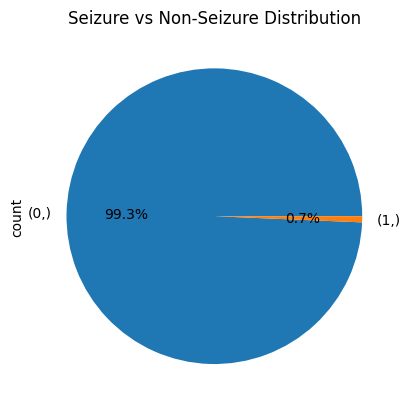

# CHB-MIT Preprocessing
This directory contains the preprocessing scripts for the CHB-MIT Scalp EEG Database. 

### Export raw windows
To export the windowed raw EEG data, as a `.npy` file, run each cell in `Reformating.ipynb`. As sanity check the `Seizure vs Non-Seizure Distribution` graph should be as follows:


and the `describe()` function should return the following:
```
0    511
dtype: int64
                  0
count  76667.000000
mean       0.006665
std        0.081369
min        0.000000
25%        0.000000
50%        0.000000
75%        0.000000
max        1.000000
```


### Downloading the CHB-MIT Scalp EEG Database
Official download instructions can be found at [PhysioNet](https://physionet.org/content/chbmit/1.0.0/). The following command was used to download the dataset:
```bash
caffeinate -dimsu wget -r -N -c -np -nH --cut-dirs=1 https://physionet.org/files/chbmit/1.0.0/
```
drop `caffeinate -dimsu` if you are not on a Mac.