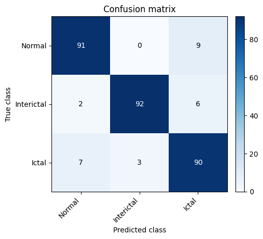
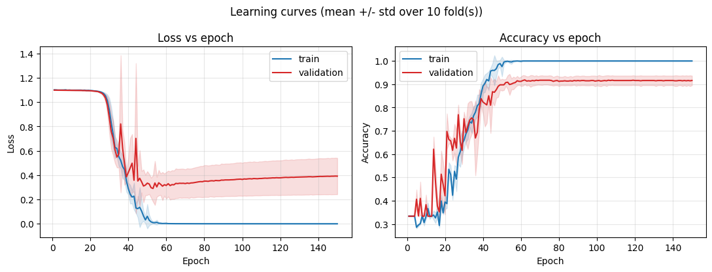

# EEG Seizure Detection — 13-Layer 1-D CNN (PyTorch)

A PyTorch reimplementation of the 13-layer 1-D convolutional neural network from
Acharya et al. (2018) for automated three-class classification of EEG segments as
**normal**, **preictal**, or **ictal (seizure)**, evaluated with ten-fold
cross-validation on the Bonn University EEG dataset.

## What's in the repo

| File | Purpose |
|------|---------|
| `Data_Preprocesing.ipynb` | Loads the Bonn `.txt` segments, assigns the three-class labels, and applies per-segment z-score normalization. Produces `X` `(N, 4097)` and `y` `(N,)`. |
| `Arch.py` | The network: 5 conv + 5 max-pool feature layers (LeakyReLU) followed by 3 fully-connected layers, ending in a 3-way output. |
| `train_kfold.py` | Ten-fold stratified cross-validation, training/evaluation loop, metrics, and plotting helpers (`main`, `plot_learning_curves`, `plot_confusion_matrix`). |

## Data setup

Download the Bonn EEG dataset (Andrzejak et al., 2001) and arrange the set folders
under `Bonn-EEG-Dataset-main/`, e.g. `Set_O/`, `Set_F/`, `Set_S/`, each containing
100 single-channel `.txt` files of 4097 samples (23.6 s at 173.61 Hz).

The three classes follow the paper's Set B / Set D / Set E, which correspond to the
file-naming sets **O**, **F**, **S**:

- **O** (Set B) → normal (healthy, eyes closed) → label `0`
- **F** (Set D) → preictal / interictal within the epileptogenic zone → label `1`
- **S** (Set E) → ictal / seizure → label `2`

## Results
| Metric | reimplementation results | paper results |
|--------|--------------|---------------|
| accuracy           | 91.00% (+/- 4.73) | 88.67% |
| ppv                | 95.50%            | 95.00% |
| sensitivity        | 95.50%            | 95.00% |
| specificity        | 91.00%            | 90.00% |

The reimplementation accuracy is slightly higher than the original paper's, but lies inside the margin of error. This and the other metrics small differences is likely due to the framework differences (2026 PyTorch vs. 2018 MATLAB).

   
  

## Citations

**Method (paper reproduced):**

> U. R. Acharya, S. L. Oh, Y. Hagiwara, J. H. Tan, and H. Adeli, "Deep convolutional
> neural network for the automated detection and diagnosis of seizure using EEG
> signals," *Computers in Biology and Medicine*, vol. 100, pp. 270–278, 2018.
> doi: 10.1016/j.compbiomed.2017.09.017

**Dataset (Bonn University EEG):**

> R. G. Andrzejak, K. Lehnertz, F. Mormann, C. Rieke, P. David, and C. E. Elger,
> "Indications of nonlinear deterministic and finite-dimensional structures in time
> series of brain electrical activity: Dependence on recording region and brain
> state," *Physical Review E*, vol. 64, no. 6, p. 061907, 2001.
> doi: 10.1103/PhysRevE.64.061907

This repository is an independent reimplementation and is not affiliated with or
endorsed by the original authors.