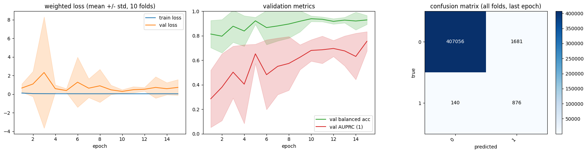
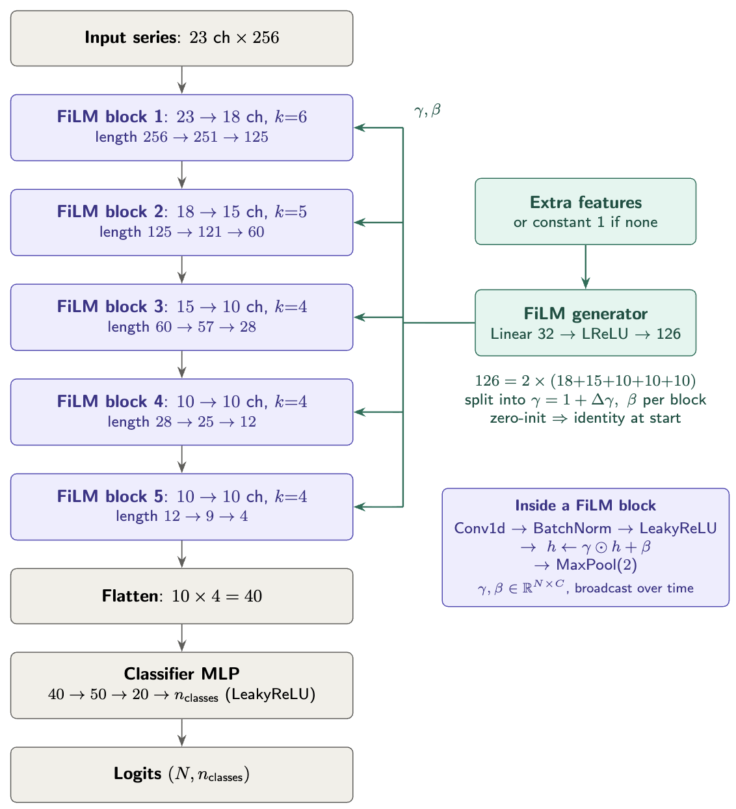

# EEG Seizure Detection — Improved Architecture

This is a work-in-progress experiment to create a new architecture for seizure detection using the CHB-MIT dataset. The architecture is based on the original paper [1], which is exactly reimplemented in [CNN_Seizure_Detection](../CNN_Seizure_Detection/Notebook.ipynb).

> [!WARNING]
> **Work in progress.** The architecture is not yet fully implemented and results are not final.

---

## What's in here

```
train_gpu.py            ← training script
Architectures.py        ← model definitions
configs/
  default_training_config.yaml   ← base hyperparameters
  experiments/
    ficnn_apen.yaml              ← FiCNN + raw EEG + ApEn conditioning
    ficnn_control.yaml           ← FiCNN + raw EEG + no conditioning
    ficrnn_atar_apen.yaml        ← FiCRNN + ATAR-denoised + ApEn (template with tune block)
utils.py                ← ApEn implementation
denois.py               ← ATAR denoising
```

---

## Data setup

Before training, run [../CHB-MIT_Formating/Reformating.ipynb](../CHB-MIT_Formating/Reformating.ipynb) to export the CHB-MIT dataset into per-patient `X.npy` / `y.npy` files. The default expected path is `../CHB-MIT_Formating/npy_data/`.

---

## Quick start

```bash
# list available experiments
python train_gpu.py --list-experiments

# run an experiment with default hyperparams
python train_gpu.py --exp ficnn_apen

# run a quick hyperparameter search first, then full CV
python train_gpu.py --exp ficnn_apen --tune

# override any hyperparam on the fly
python train_gpu.py --exp ficnn_apen --lr 1e-3 --epochs 50 --folds 5
```

Results land in `results/<exp_name>/` — one subfolder per experiment run.

---

## Setting up a new experiment

### 1. Define your model in `Architectures.py`

The only required signature is `(extra_features, n_classes)`:

```python
class MyModel(nn.Module):
    def __init__(self, extra_features=0, n_classes=2):
        ...

    def forward(self, x_serie, x_features):
        # x_serie:   (N, C, T) float32
        # x_features: (N, extra_features) float32, or None if extra_features=0
        ...
```

### 2. Register it in `train_gpu.py`

Find the `MODEL_REGISTRY` dict near the top and add one line:

```python
MODEL_REGISTRY = {
    "ficnn":   FiCNN,
    "ficrnn":  FiCRNN,
    "mymodel": MyModel,   # ← add this
}
```

Also add the import at the top:

```python
from Architectures import FiCNN, FiCRNN, MyModel
```

### 3. Create an experiment yaml

Create `configs/experiments/mymodel_apen.yaml`:

```yaml
# required: what to train
model: mymodel
preprocess: raw      # raw | atar  (which EEG cache to use)
features: apen       # apen | none (conditioning signal; none = control)

# optional: dataset paths (override the CLI defaults for this experiment)
data_dir: /path/to/my/npy_data
cache_dir: /path/to/cache
out_dir: /path/to/results

# optional: override base hyperparams for this experiment
epochs: 40
folds: 5

# optional: hyperparameter search config (only used with --tune)
tune:
  n_trials: 8        # random configs to evaluate
  n_folds: 1         # folds per trial (1 = fast signal)
  n_epochs: 10       # epochs per trial
  search:
    lr: [1.0e-4, 5.0e-4, 1.0e-3, 3.0e-3]
    weight_decay: [0.0, 1.0e-4, 1.0e-3]
    batch_size: [128, 256, 512]
```

### 4. Run it

```bash
# quick sanity check — tune finds decent hyperparams, then trains fully
python train_gpu.py --exp mymodel_apen --tune

# or skip tune if you already know good hyperparams
python train_gpu.py --exp mymodel_apen
```

---

## Config system

Parameters are resolved in this order (later overrides earlier):

```
configs/default_training_config.yaml      ← base hyperparams (lr, wd, epochs, …)
  └── configs/experiments/<name>.yaml     ← experiment-specific overrides + tune block
        └── CLI flags                     ← one-off overrides (--lr, --epochs, …)
```

**`default_training_config.yaml` reference:**

| Key | Default | Description |
|---|---|---|
| `folds` | 10 | Patient-stratified k-folds (`StratifiedGroupKFold`) |
| `epochs` | 30 | Training epochs per fold |
| `batch_size` | 256 | Training batch size |
| `eval_batch_size` | 4096 | Evaluation batch size |
| `lr` | 3e-4 | AdamW learning rate |
| `weight_decay` | 1e-4 | AdamW weight decay |
| `clip` | 1.0 | Gradient norm clipping |
| `power` | 0.5 | Class-weight exponent (0=none, 0.5=sqrt, 1=inv-freq) |
| `patience` | 0 | Early stopping patience in epochs (0 = disabled) |
| `data_on` | auto | Where EEG windows live: `auto` / `gpu` / `ram` |
| `seed` | 123 | Random seed |
| `workers` | cpu_count−1 | Parallel workers for cache building |
| `fs` | 256.0 | Sampling rate Hz (used for FP/hour reporting only) |
| `data_fraction` | `1.0` | Fraction of windows to keep per patient (stratified by class). Useful values: `0.75`, `0.5`, `0.25`, `0.1` |
| `data_dir` | `../CHB-MIT_Formating/npy_data` | Path to the folder containing per-patient `X.npy`/`y.npy` |
| `cache_dir` | `cache` | Directory for preprocessed caches |
| `out_dir` | `results` | Root directory for run outputs |

Path keys (`data_dir`, `cache_dir`, `out_dir`) are not in the base config by default — set them only in experiment yamls where you need to override the defaults, or pass `--data-dir` / `--cache-dir` / `--out-dir` on the CLI.

---

## Output files

After a run, `results/<exp_name>/` contains:

| File | Content |
|---|---|
| `summary.json` | Mean ± std metrics across folds (best and last epoch), pooled confusion matrix |
| `history.json` | Per-fold, per-epoch loss and metrics |
| `summary.png` | Loss curves, validation metrics, confusion matrix |
| `fold1.pt … foldN.pt` | Best-epoch model weights per fold |
| `tune_results.json` | (only with `--tune`) All trial results + winning params |

---

## Results

| Metric | Current Architecture (CHB-MIT) | Paper reimplementation (Bonn) | Paper (Bonn) |
|---|---|---|---|
| Balanced accuracy | 92.91% ± 3.67 | — | — |
| Accuracy | 99.56% | 91.00% ± 4.73 | 88.67% |
| Sensitivity | 86.2% | 95.50% | 95.00% |
| Specificity | 99.59% | 91.00% | 90.00% |

Note: CHB-MIT has ~0.1–0.7% seizure windows vs. 50% in Bonn, so balanced accuracy is the primary metric here.

<div align="center">
  
  
</div>

---

## Citations
